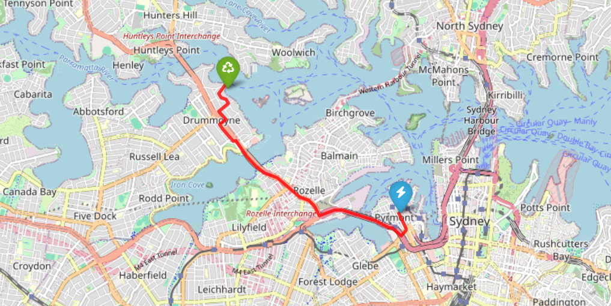
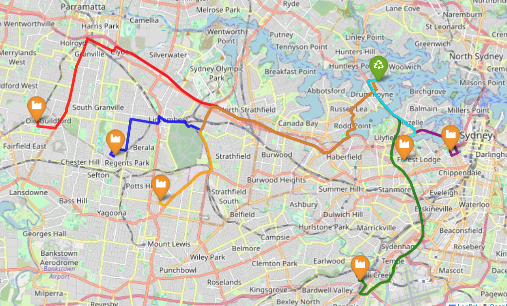

# Quantitative Logistics and Transportation Cost Estimation Framework for End-of-Life Photovoltaic Module Recycling

## Background and Motivation
- Australia is one of the top users of solar panels in the world. As the panels installed years ago start reaching the end of their 20 to 25-year lifespans, we are going to face a massive amount of solar waste.
- Most solar farms are located far away from big cities. Moving old solar panels from these distant locations to central recycling centers is very expensive. Because shipping costs so much, it is currently cheaper to just dump the panels in a landfill, which is bad for the environment.
- We need to figure out the cheapest and smartest way to handle this waste. Is it better to pack up the panels and ship them to one large central factory (Conventional recycling) or is it better to bring a smaller recycling setup directly to the solar farm (Mobile recycling)?
- Old solar panels contain valuable materials like silicon, silver, and copper. This project helps people figure out exactly how many panels need to be recycled in a single trip to cover the high shipping costs and actually make a profit.

## Project Goals
- The primary objective of this project is to provide a clear and accessible estimator (calculator) that policymakers, recycling companies, and solar farm owners can easily use to estimate the total transportation cost of moving end-of-life (EoL) solar panels from solar farms to the nearest recycling hub, and eventually transported to suppliers for each recovered material.
- This project also estimate the total value of the materials recovered from the panels. This helps determine exactly how many panels need to be recycled in a single trip to cover the shipping costs and start making a profit.
- In the future, this project might be developed to show the difference in transportation costs between Conventional recycling (shipping panels to a recycling hub) and Mobile recycling (bringing the recycling equipment directly to the solar farm).

## Methodology

### Assumptions
In order to simplify the calculation, this project decided to apply several assumptions.
1. "Photovoltaic solar panels consist of 95% recyclable materials."[^1] This means almost 100% of PV components can be recycled and sold. Hence, our assumption is 100% of PV materials can be recycled and would be available to be sold to supplier.
2. We use one composition panel mentioned in 'Recycling c-Si PV Modules: A Review, a Proposed Energy Model and a Manufacturing Comparison.' The composition of material in each PV module is
72% glass, 15% of Al (frame), 7% EVA and Tedlar (encapsulant and back sheet), 2.5% Si, 0.8% Cu, 0.03% Ag, 0.1% Sn and 0.1% Pb.[^2]
3. The capacity of each solar EoL module is 300 W.
4. The dimension of each solar EoL module is 1.0m x 1.7m x 0.035m.
5. Truck capacity for transporting EoL modules: 7,000 kg. 
6. Truck dimension: 2.2 m x 6.2 m x 2.4 m.
7. Transport cost is currently based on fuel only. The price of diesel fuel in Australia is AUD 2.25 per liter based on the latest update from 18 May 2026.[^3] Truck diesel efficiency is 17L/100km.[^4] Average speed is 45km/hr.
8. Labour Cost assumptions: 45$/hr for operator, 42$/hr for driver, 1 driver 2 operators per truck.
9. Mobile Recycling assumptions: parking site is 120km away from power station since the parking site is not established yet.
10. For estimating monetary value and converting different units, we use the following estimation. \
    18kg/panel \
    0.3kW/panel \
    60kg/kW \
    10$/kw = worth of panel power \
    10$/50kg = 0.2$/kg = worth of panel waste

### Data Collection
#### Power Stations
This project focuses on Large-Scale PV Systems. The data about these PV systems is sourced from the Clean Energy Regulator and is up to date as of 31 December 2025.[^5]
#### Recycling Sites
This project uses 9 different recycling sites that are collected from individual research. The list is provided in `recycling_sites.csv`.
#### Suppliers
This project uses several suppliers that would buy materials from recycled PV waste. The suppliers divided into 6 categories based on materials they supply: Aluminium, Copper, Glass, Plastic/EVA, Silicon, and Silver. The list is obtained from individual research and provided in `suppliers.xlsx`.

Note: this project allows user to add more power stations, recycling sites, and/or suppliers places, so the list from data collection step are not fixed.

### Calculation
For conventional recycling, the calculator works as the following.
1. Calculate the number of trucks needed to carry EoL based on how many kW/kg/number of panels inputted by user.
2. Find and estimate distance of the closest recycling site from the power station, and the closest supplier of each material from the recycling site. This project use Open Source Routing Machine (OSRM) in order to find the optimal route and driving distance to the closest place. The following images show the example of OSRM application in this project.
<table>
  <tr>
    <td align="center">
      
      <br />
      <sub><b>Figure 1:</b> Optimal Route from Power Station to CLosest Recycling Site.</sub>
    </td>
    <td align="center">
      
      <br />
      <sub><b>Figure 2:</b> Optimal Route from Recycling Site to Closest Suppliers.</sub>
    </td>
  </tr>
</table>

3. Calculate the transportation cost (fuel and labour cost) on the path recycling site -> power stations -> recycling site -> suppliers -> recycling site.
4. Calculate the approximate worth of panel waste and the profit in AU$.

For mobile recycling, the calculator works as the following.
1. Find and estimate the closest suppliers for each material from the power station because recycling process is done onsite (at the power station).
2. Calculate the transportation cost for recycling onsite. The path for mobile recycling is parking site -> power stations -> suppliers -> parking site.
3. Calculate the approximate worth of panel waste and the profit in AU$.

However, due to ongoing research about mobile recycle, this project still not be able to accurately estimate the transportation cost of mobile recycle.

## Output
This github repository provides:
- One Jupyter Notebook file named `code.ipynb` containing code for estimating transportation costs of Conventional and Mobile Recycling of Solar EoL modules to suppliers of each recoverable material in Australia. 
- One html file named `calculator.html`, which serves as the interactive calculator, where user can input information, and eventually will receive the calculation result. Note that this file can only be ran in localhost.

## Usage
To access the raw code for the calculator in the `code.ipynb`, user needs to follow the following steps.
1. User must have Jupyter Notebook installed on their device.
2. Open terminal or command prompt and clone this github repository by running:
```bash
   git clone https://github.com/12Riana/Calc_Transport_EoL.git
```
3. Launch Jupyter Notebook and open the `code.ipynb` file.
4. Run the notebook cells sequentially. When prompted, input the required parameters to process the calculations.

To get the calculator up and running on their local machine, user needs to follow the following steps.
1. Open terminal or command prompt and clone this repository by running:
```bash
   git clone https://github.com/12Riana/Calc_Transport_EoL.git
```
  (Note: do not do this step if you have done it previously).
2. Navigate into the project folder using your terminal:
```bash
   cd Calc_Transport_EoL
```
3. Start a local web server using Python:
```bash
   python -m http.server
```
  (Note: If you use mac OS, type `python3 -m http.server` instead).

4. Leave the terminal running, open one web browser (Chrome, Safari, Edge, etc.), and go to the following URL:
```bash
   http://localhost:8000/calculator.html
```
5. The calculator is ready to use! Input the necessary information (unit, value, and power stations), then it will output the estimated transportation cost and profit for conventional recycling method. User can also add power stations, recycling sites, or suppliers if they have data outside what have been included in the dataset used in this project.

## Future Work
1. The dataset for this project is not complete and might not be accurate, especially regarding recycling sites and suppliers, because it based on individual research. User can improve the dataset by editing the list with more accurate data.
2. This project still apply many assumptions in order to simplify the cost calculation. User can improve this project by removing some assumptions if they have valid data to substitute the number provided in the assumptions.
3. User can add other aspects that can be considered in transportation costs other than what is used in this project, e.g., truck maintenance costs.

## References
[^1]: Clean Energy Council. (2025). [Recycling Wind Turbines, Solar Panels and Batteries: Fact Sheet](https://cleanenergycouncil.org.au/for-consumers/fact-sheets/recycling-get-the-facts/recyling-wind-turbines-solar-panels-batteries).
[^2]: Mulazzani, A., Eleftheriadis, P., Leva, S (2022). [Recycling c-Si PV Modules: A Review, a Proposed Energy Model and a Manufacturing Comparison](https://doi.org/10.3390/en15228419).
[^3]: GlobalPetrolPrices. (2026, May 18). [Australia Diesel prices](https://www.globalpetrolprices.com/Australia/diesel_prices/).
[^4]: Truck1. [Isuzu NQR75 Tech Specs](https://www.truck1.eu/blog/isuzu-nqr75-nqr75r-tech-specs-t31726).
[^5]: Australian Photovoltaic Institute (APVI). [Australian PV Map - Power Stations](https://pv-map.apvi.org.au/power-stations).
